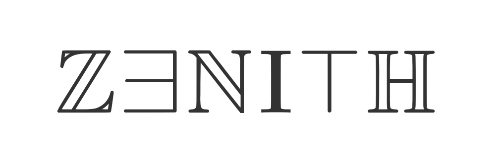

# Zenith theorem prover

This is my personal attempt at making a theorem prover with an optimised interactive UI logic.

## Scope

Goals:

- Implement a [core language](src/core/term.rs) based on the [calculus of constructions](https://en.wikipedia.org/wiki/Calculus_of_constructions);
- Implement an elaborator with type inference and support for typeclasses;
- Formalise basic mathematical concepts;
- Implement an optimised tactic mode.

For the sake of simplicity, **computation of (co)inductive types is excluded from the core language**. The first development stage will not focus on any programming language stuff.
