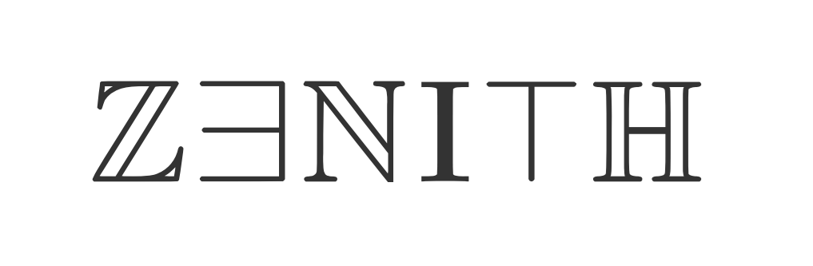

# Zenith: a minimalistic framework for formal mathematics

This is my personal attempt at making a theorem prover centred around the classical foundation of ZFC, but which also uses dependent types as an abstraction mechanism to facilitate the organisation of mathematical theories.

If possible, this will be made compatible with other foundations as well.

## Scope

Goals:

- Implement a [core language](src/core/term.rs) based on the [calculus of constructions](https://en.wikipedia.org/wiki/Calculus_of_constructions);
- Implement an elaborator with type inference and support for typeclasses;
- Formalise basic mathematical concepts;
- Implement a tactic mode.

Non-goals:

- Implement (co)inductive types in the core language;
- Focus on constructive mathematics;
- Focus on the univalence axiom and the interpretation of propositional equalities as homotopies.

For the sake of simplicity, **computation of (co)inductive types is excluded from the core language**. The first stage of development will not focus on any programming language stuff.
