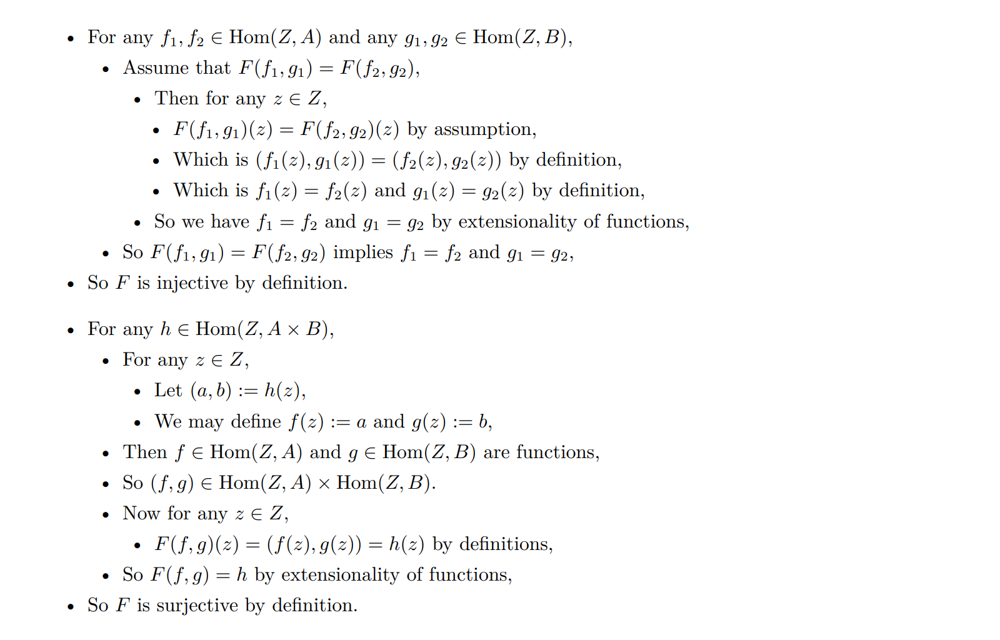
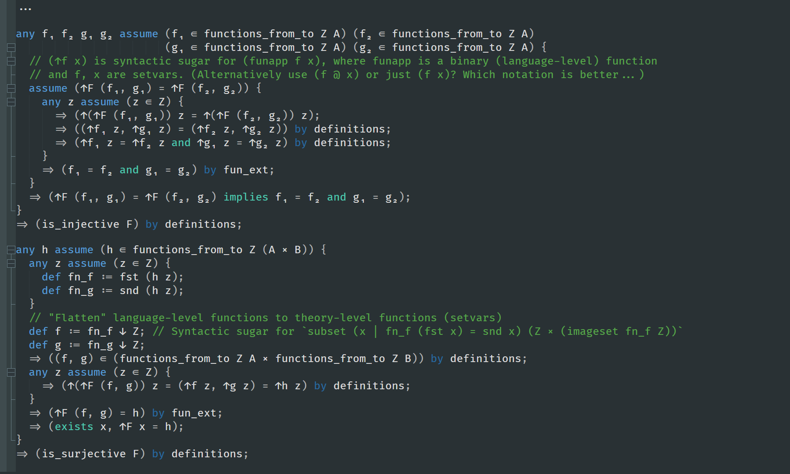

# (Current design of the proof language)

General idea: every line you write down after `=>` will become a theorem, which may or may not have a name. The computer will remember every theorem and try to "follow" your thoughts, with several algorithms running in parallel.

## Syntax of first-order formulas

ApiMu will use a standard first-order logic with equality, extended with function and predicate metavariables to express formula schemas like the separation and replacement axioms in ZFC.

A **context `(F, P, Γ)`** is composed of **the set `F` of functions**, **`P` of predicates**, and **`Γ` of assumptions**. (It replaces the notions of "signature" and "theory".)

- Each element of `F` and `P` is a pair of a string (name) and a nonnegative integer (arity).
  - These will be written as `φ/2`, `f/3`, etc.
    - In type theories (higher-order logics), these can be written as `φ : ι → ι → *`, `f : ι → ι → ι → ι`, etc. where `ι` stands for the type of individuals and `*` the type/universe of propositions.
  - Nullary functions like `x/0` (`x : ι`) stand for individual variables. These are different from other functions in a first-order system (e.g. they can be universally or existentially quantified over).
  - Nullary predicates like `p/0` (`p : *`) stand for propositions.
- Each element of `Γ` is a pair of a string (name) and a well-formed "formula" or "formula schema" defined w.r.t. `F` and `P`.
  - These will be written as `name : p ∧ q`, etc. like in type theories.
  - The set of "terms" (expressions of type `ι`) under some `F` is inductively defined as:
    - For any element `f/n ∈ F` and terms `t₁, t₂, ..., tₙ` under `F`, the expression `(f t₁ t₂ ... tₙ)` is also a term. The base case is when `n = 0`.
  - The set of "formulas" (expressions of type `*`) under some `F` and `P` is inductively defined as:
    - For any element `p/n ∈ P` and terms `t₁, t₂, ..., tₙ` under `F`, the expression `(p t₁ t₂ ... tₙ)` is an (atomic) formula. This also includes the case `n = 0`.
    - If `t₁` and `t₂` are terms under `F`, then `(t₁ = t₂)` is an (atomic) formula.
    - `true` and `false` are formulas.
      > Alternatively written as `⊤` and `⊥`.
    - If `e` is a formula under `F` and `P`, then so is `(not e)`.
      > Alternatively written as `(¬e)`.
    - If `e₁` and `e₂` are formulas under `F` and `P`, then so are `(e₁ and e₂)`, `(e₁ or e₂)`, `(e₁ implies e₂)` and `(e₁ iff e₂)`.
      > Alternatively written as `(e₁ ∧ e₂)`, `(e₁ ∨ e₂)`, `(e₁ → e₂)` and `(e₁ ↔ e₂)`.
    - For any string `x` not occurring in `F`, if `e` is a formula under `F ∪ {x/0}` and `P`, then `(forall x, e)`, `(exists x, e)` and `(unique x, e)` are formulas under `F` and `P`.
      > Alternatively written as `(∀ x, e)`, `(∃ x, e)` and `(∃! x, e)`.
  - The set of "formula schemas" (expression schemas of type `*`) under some `F` and `P` is inductively defined as:
    - ~~Any formula under `F` and `P` is also a formula schema.~~
    - For any string `f` not occurring in `F`, and any positive integer `n`, if `e` is a formula or schema under `F ∪ {f/n}` and `P`, then `(forallfunc f/n, e)` is a formula schema under `F` and `P`. (The `n = 0` case is already covered in the previous rule, so it's not included here.)
      > Alternatively written as `(∀# f/n, e)`.
    - For any string `p` not occurring in `P`, and any nonnegative integer `n`, if `e` is a formula or schema under `F` and `P ∪ {p/n}`, then `(forallpred p/n, e)` is a formula schema under `F` and `P`.
      > Alternatively written as `(∀$ p/n, e)`.
  - The last two rules should be understood as a way to express "formula schemas" (infinite sets of formulas obtained by specializing those function and predicate variables). Although they could as well represent second-order quantifications, I'm not going to fully support second-order logic (you can see there's no second-order existential quantifiers, and the `∀#` and `∀$` must appear at the beginning). Instead I will use sets to represent functions and higher-order functions...
- As explained above, the definition of a formula/schema depends on `F` and `P`. A context `(F, P, Γ)` is well-formed only if all formulas/schemas in `Γ` are well-formed under `F` and `P`.
- For simplicity we assume that no two elements in `F`, `P` or `Γ` share the same name. Below, context extensions like `Γ ∪ {h : p ∧ q}` are assumed to be well-formed (no duplicate names).
  - (In the actual implementation, later names will "override" earlier names)
- The domain of discourse `ι` is considered to be non-empty (inhabited). The individual variable `initial : ι` can be used anywhere.
- For convenience in writing proofs, I will also define the set of well-formed n-ary functions/predicates, generalizing the previous definition of well-formed terms/formulas.
  - Well-formed terms/formulas themselves are nullary functions/predicates.
  - ~~(Context) For any `f/n` in `F`, `f` itself is also an n-ary function. Similarly for `p/n` in `P`.~~
  - (Abstraction)
    - For any list of strings `xᵢ` each not occurring in `F`, if `t` is an m-ary function under `F ∪ {x₁/0, x₂/0, ..., xₙ/0}` and `P`, then `(x₁ x₂ ... xₙ | t)` is an (n+m)-ary function (expression of type `ι → ι → ... → ι`) under `F` and `P`.
    - For any list of strings `xᵢ` each not occurring in `F`, if `e` is an m-ary predicate under `F ∪ {x₁/0, x₂/0, ..., xₙ/0}` and `P`, then `(x₁ x₂ ... xₙ | e)` is an (n+m)-ary predicate (expression of type `ι → ι → ... → *`) under `F` and `P`.
    - This is used to supply second-order arguments to some rules and constants; they are never directly applied to term variables. (Probably we could discard it and use definitions instead? But it looks more convenient for now...)
  - ~~(Application)~~
    - ~~For any n-ary function `f` with n > 0 and term `t`, `(f t)` is an (n-1)-ary function, the same as replacing `x₁` by `t` in the body of `f`.~~
    - ~~For any n-ary predicate `p` with n > 0 and term `t`, `(p t)` is an (n-1)-ary predicate, the same as replacing `x₁` by `t` in the body of `p`.~~
    - Convention: every function must be fully applied in an expression...
    - (Possible feature: for any nullary function (term) `f` and another term `t`, `(f t)` is the same as `(funapp f t)`, where `funapp` is a binary function assigned using the `#el +implicit_funapp` preprocessor command.)
  - ~~These look like a kind of "lambda expressions", but are all first-order so very trivial (I will store them in normal forms). They are weaker than the "function definition rules" introduced below, since they must be total, and cannot utilize definite/indefinite descriptions. (Probably I will need to unify these two ways of specifying functions, by e.g. supporting inline iota/epsilon operators... but for now I just want to make a working demo so don't care)~~

## "Natural deduction" rules

When I was doing an assignment of IUM, I found this style of writing makes proofs particularly clear...

This would translate (assuming the AI is powerful enough, and ignoring some loss of generality? idk) to something "more formal":

(This is like to rely heavily on `section`s and `parameter`s in Lean, but those `any`s and `assume`s interact better with definitions, and using FOL + ZFC makes it more cumbersome in dealing with higher-order functions.)

Just like in Lean, the important cases here are `implies` and `forall`. In ApiMu, their introduction rules are "context-changing" (you open up a new scope, get a new assumption/variable, then prove the consequence/property). Other similar rules in natural deduction (like or-elimination, exists-elimination) can be defined in terms of them.

Context-changing keywords:

- `assume (<formula-or-schema>) name <name> ...`
- `any <var-name> ...`
- `anyfunc <func-name>/<arity> ...`
- `anypred <pred-name>/<arity> ...`

The `...` part can either be one declaration, or a list of declarations inside curly brackets `{ ... }`. Declarations in this part will be checked under an extended context. Unlike in C, these declarations **are still available in the outer scope**, but corresponding introduction rules will be applied on them.

The other rules are represented in something like "derivation trees" or "proof terms", e.g. if you have assumptions/theorems `h1 : p`, `h2 : q implies r` and `h3 : q`, then `and.i h1 (implies.e h2 h3)` is a proof of `p and r`. A syntactic sugar: due to their frequent use, `implies.e`, `forall.e`, `forallfunc.e` and `forallpred.e` can be omitted! So `implies.e h2 h3` can be shortened to `h2 h3`. Kinda like in intuitionistic type theories, but not quite (only the 1.5th-order fragment is available, and higher-order things should be represented as sets).

To prove a theorem **manually**, write `=> (<theorem-statement>) name <name> proof <proof-term>;` where `<theorem-statement>` is a formula or schema, `<name>` is an identifier, **and `<proof-term>` is inductively defined w.r.t. the local context `(F, P, Γ)` and known theorems `Δ` by:**

- Any name in `Γ` or `Δ` is a proof of its corresponding proposition.
- **(Lemma, aka. "cut rule")** If a block of declarations *ends with a proof of formula* `P`, then the block itself is a proof of formula `P` (i.e. using blocks, we can prove some lemmas before proving `P`).
- (And-intro) If `hp` is a proof of `P` and `hq` is a proof of `Q`, then `(and.i hp hq)` is a proof of `(P and Q)`.
- (And-elim) If `hpq` is a proof of `(P and Q)`, then `(and.l hpq)` is a proof of `P`, and `(and.r hpq)` is a proof of `Q`.
- (Or-intro) ... `or.l` ... `or.r` ...
- (Or-elim) ... `or.e` ...
- (Implies-intro) For any new name `hp`, if, under the context `(F, P, Γ ∪ {hp : P})`, the expression `hq` is a proof of `Q`, then `(assume P name hp { => (Q) by hq; })` is a proof of `(P implies Q)` under the context `(F, P, Γ)`. Here the curly brackets and the semicolon can be omitted.
- (Implies-elim) If `hpq` is a proof of `(P implies Q)` and `hp` is a proof of `P`, then both `(implies.e hpq hp)` and `(hpq hp)` are proofs of `Q`.
- (Not-intro) ... `not.i` ...
- (Not-elim) ... `not.e` ...
- (Iff-intro) ... `iff.i` ...
- (Iff-elim) ... `iff.l` ... `iff.r` ...
- (True-intro) ... `true.i` ...
- (False-elim, aka. *ex falso quodlibet*) ... `false.e` ...
- (Stronger false-elim, aka. *reductio ad absurdum*) ... `raa` ...
- (Equals-intro) For any well-formed term `t`, the expression `(eq.i t)` is a proof of `(t = t)`.
- **(Equals-elim)** For any well-formed unary predicate `P`, if `heq` is a proof of `(a = b)` and `hpa` is a proof of `(P a)`, then the expression `(eq.e P heq hpa)` is a proof of `(P b)`.
- (Forall-intro) For any new name `x`, if, under the context `(F ∪ {x/0}, P, Γ)`, the expression `hp` is a proof of `P(x)`, then `(any x { => (P) by hp; })` is a proof of `(forall x, P(x))` under the context `(F, P, Γ)`. Here the curly brackets and the semicolon can be omitted.
- **(Forall-elim)** If `hpx` is a proof of `(forall x, P(x))` and `t` is a well-formed term (expression of type `ι`), then both `(forall.e hpx t)` and `(hpx t)` are proofs of `P(t)`, where `P(t) := P(x)[t/x]` (replace all "free occurrences" of `x` in `P` by `t`. Bound variables are automatically renamed to prevent naming clashes.)
- **(Exists-intro)** If `hpt` is a proof of `P(t)` where `P` is a well-formed unary predicate (expression of type `ι → *`), then `(exists.i P t hpt)` is a proof of `(exists x, P(x))`.
- (Exists-elim) If `hex` is a proof of `(exists x, P(x))` and `hq` is a proof of `(forall x, P(x) → Q)` where `x` does not occur free in `Q`, then `(exists.e Q hex hq)` is a proof of `Q`. **(Most of the time when you want to use AC, this rule is actually more suitable.)**
- (Unique-intro) If `hex` is a proof of `(exists x, P(x))` and `hone` is a proof of `(forall x, (P(x) → forall y, (P(y) → x = y)))`, then `(unique.i hex hone)` is a proof of `(unique x, P(x))`.
- (Unique-elim) If `h` is a proof of `(unique x, P(x))`, then `(unique.l h)` is a proof of `(exists x, P(x))` and `(unique.r h)` is a proof of `(forall x, forall y, P(x) → P(y) → x = y)`.
- (Forallfunc-intro) For any new name `f`, if, under the context `(F ∪ {x/n}, P, Γ)`, the expression `hp` is a proof of `P(f)`, then `(anyfunc f/n { => (P) by hp; })` is a **proof schema** of `(forallfunc f, P(f))` under the context `(F, P, Γ)`. Here the curly brackets and the semicolon can be omitted.
- **(Forallfunc-elim)** If `hpf` is a proof schema of `(forallpred f/n, P(f))` and `g` is a well-formed n-ary function (expression of type `ι → ι → ... → ι`), then both `(forallfunc.e hpf g)` and `(hpf g)` are proofs of `P(g)`, where `P(g) := P(f)[g/f]` (replace all "free occurrences" of `f` in `P` by `g`, keeping original parameters. Bound variables are automatically renamed to prevent naming clashes. This is most easily implemented using de Brujin indices.)
- (Forallpred-intro) ... `(anypred p/n { => (P) by hp; })` ...
- **(Forallpred-elim)** ... `(forallpred.e hpp q)` and `(hpp q)` ...

In general, the major premise(s) appear before the minor premise(s). Six hardest rules are marked in bold font.

- "Lemma / cut rule" is not necessary, but still very important (they are used to avoid proving similar things multiple times; proofs can get exponentially larger without them). In general it is difficult for a computer to come up with suitable lemmas, so the user must explicitly state them.
- "Equals-elimination" require second-order specialization, but there seems to be some methods that deal with equational theories more efficiently (?).
- "Forall-elimination" and "exists-introduction" can be solved by adding unification to the tablau method. An intuitive explanation is, instead of enumerating all possible specializations (terms/formulas), one can instead enumerate known theorems/rules and find out which specializations can make the theorems applicable later on (represented in a most general unifier), and apply the theorems until the goal can be directly solved. This avoids going over "useless" specializations, at least...
- "Forallfunc-elimination" and "forallpred-elimination" both require second-order specialization. These should be used only in specific situations, like the axiom schemas of separation/replacement in ZFC or the priciple of induction on the naturals, and most of the time we actually want to provide explicit specializations... They are hard even for humans!

After proof-checking, a theorem will be added back into the "known theorem pool" `Δ` maintained by ApiMu. This is like the `Γ` in the context, but not the same thing; it represents a set of theorems derivable under the current context and assumptions, including but not limited to the assumptions themselves. ApiMu will guarantee that every explicitly stated theorem gets added to `Δ`, but there may also be additional theorems generated by the inference engines.

- `Δ` is also stored in a stack. Denote its top layer by `Δ'`, and the second-to-top layer by `Δ''`.

The introduction rules for `implies`, `forall`, `forallfunc` and `forallpred` are automatically applied to all applicable theorems in the top level of `Δ`, when leaving from some section. (Below, the `...` in front of `φ` is used to denote all "second-order quantifiers" in front of a formula schema.)

- When leaving from `assume (h : <assumption>)` section, for every theorem (schema) `...φ` in `Δ'`, the theorem (schema) `...(<assumption> → φ)` will be added back to `Δ''`.
  - The "second-order quantifiers" will remain in the front. (This can be understood as simultaneously putting assumptions in front of an infinite family of formulas.)
    - This rule is seemingly useless and it is not the same as normal higher-order rules; will not be implemented... (New rule: schemas cannot escape from `assume` sections.)
  - **Exception: if `<assumption>` itself contains "second-order quantifiers", nothing will be added back!** First-order logic is not sufficient to express such outcomes, and "assuming an infinite set of propositions" is only useful in expressing axiom schemas...
- When leaving from `any x` section, for every theorem (schema) `...φ` in `Δ'`, the theorem (schema) `...(forall x, φ)` will be added back to `Δ''`.
  - The "second-order quantifiers" will remain in the front. (This can be understood as simultaneously putting quantifiers in front of an infinite family of formulas.)
    - This rule is seemingly useless and it is not the same as normal higher-order rules; will not be implemented... (New rule: schemas cannot escape from `any` sections.)
- When leaving from `anyfunc f/n` section, for every theorem (schema) `...φ` in `Δ'`, the theorem (schema) `(forallfunc f/n, ...φ)` will be added back to `Δ''`.
- When leaving from `anypred p/n` section, for every theorem (schema) `...φ` in `Δ'`, the theorem (schema) `(forallpred p/n, ...φ)` will be added back to `Δ''`.

## "Extension by definition" rules

- `def f := <term>`: adds new function symbol `f/0` and its defining axiom `f = <term>` to context.
- `def p :↔ <formula>`: adds new predicate symbol `p/0` and its defining axiom `p ↔ <formula>` to context.
- `def f :: <formula-with-f-free>`: adds new function symbol `f/0` and its defining axiom `forall y, <formula-with-f-free>[y/f] ↔ y = f` to context, by definite description.
  - The proof for `unique f, <formula-with-f-free>` must be provided.
- `idef f :: <formula-with-f-free>`: adds new function symbol `f/0` and its defining axiom `<formula-with-f-free>` to context, by indefinite description. (This is not a conservative extension, or only "conservative" when AC is involved in the metatheory (there's no constructive argument for it), and it is sufficient to prove the AC inside the theory...)
  - The proof for `exists f, <formula-with-f-free>` must be provided.
- On leaving from `assume (h : <assumption>)` sections, their arities are unchanged; `<assumption> →` will be added in front of all local theorems (including their defining axioms).
- On leaving from `any` sections, their arities will be added by one; a new argument (the variable `x` being generalized on) is inserted at the beginning; `forall x` will be added in front of all local theorems (including their defining axioms).
- On leaving from `anyfunc` or `anypred` sections, ~~they will not be preserved. We can't represent higher-order functions directly in the first-order language, and this is also unnecessary.~~ they will become "function/predicate schemas" with one or more function/predicate arguments.

(Put definitions inside `assume` sections to get partial functions & predicates (i.e. you have nothing to say about them unless you have all the preconditions. The metatheoretic interpretation could be a three-valued logic with an "undefined" value, and every formula with "undefined" value cannot be proved or disproved...))

## Axioms

- Axioms are outermost assumptions.
- Some inference engines only work when you have a certain set of axioms (i.e. your local context contains certain things). You may need to provide their names / IDs.
- We generally use ZFC as the starting set of axioms. (See `set.mu`)

**That's all for the foundations.**

-----

## Opaque definitions

- Theorems can be modified using `private`. These will be cleared when leaving the current section. (Or more commonly, use `private` when opening a section, and use `public` to modify theorems that you want to export. The `public` declaration must be present immediately inside the section marked as `private` in order to come into effect - things nested further in will not be exported. You may need to repeat the theorem.)
- Definitions can be modified using `private`. Defining axioms can also be modified using `private`. (There are three possible combinations. The `private-public` combination is the same as `private-private`, as the defining axiom will still be removed along with the function/predicate symbol.)
- The `public-private` combination allows for "opaque definitions", which is suitable for preventing "fake theorems".

## Miscellaneous

- `undef _`: removes a predicate / function symbol / metavariable from context; removes everything in the context that depends on it (i.e. remove any non-well-formed formulas)
- `#ls` (shows the current context)
- `#ai _` (activate inference engine(s), options: `none`, `search_simple`. In all cases the default inference engine (simple unifier) will be active in a thread.)
- `#set _ _` (set parameter...)

## Inductive definitions in ZFC

- (TODO: try to complete this part based on Mario Carneiro's thesis)

## Appendix: axiomatic details

(TODO: clarify about "partial functions / predicates")

(TODO: proof of conservations. Outline: find the outermost scope for each definition, then "pull out" the definition and translate)